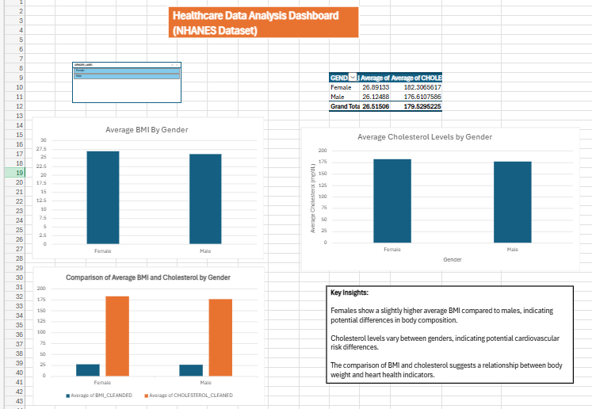

# Healthcare Data Analysis (NHANES Dataset)

## 📊 Overview
This project analyzes healthcare data from the NHANES dataset using Excel to uncover insights on BMI and cholesterol across gender groups.

---

## 🎯 Objectives
- Analyze BMI and cholesterol trends
- Compare health indicators by gender
- Build an interactive Excel dashboard
- Demonstrate data cleaning and analysis skills

---

## 📁 Dataset
- Source: NHANES (CDC)
- Data includes:
  - Demographics
  - BMI
  - Cholesterol

---

## 🛠 Tools Used
- Microsoft Excel
- Pivot Tables
- Charts
- Slicers

---

## 📊 Key Insights
- Females show a slightly higher average BMI compared to males  
- Cholesterol levels differ between genders  
- There may be a relationship between BMI and cholesterol levels  

---

## 📷 Dashboard Preview

---

## 🚀 Skills Demonstrated
- Data cleaning  
- Data analysis  
- Data visualization  
- Dashboard creation  
- Insight generation  

---

## 📌 Author
**Onyinyechi Okereke**  
Pharmacist | Data Analyst | Data Scientist
